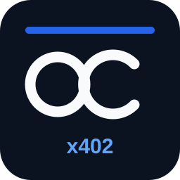

# npm Health Snapshot — x402 paid API

A machine-buyable read-only API operated by Ops Control HQ.



## Paid endpoint

`GET https://tkoqkknsezxavtxfywkm.supabase.co/functions/v1/npm-health-x402-v2?package=react`

Replace `react` with a valid npm package name.

Canonical resource URL:

`https://tkoqkknsezxavtxfywkm.supabase.co/functions/v1/npm-health-x402-v2`

## Payment

- Protocol: x402 v2
- Scheme: `exact`
- Network: Base (`eip155:8453`)
- Asset: USDC (`0x833589fCD6eDb6E08f4c7C32D4f71b54bdA02913`)
- Price: `$0.01` / `10000` atomic USDC units
- Receiving wallet: `0xf200174de10c26ce7670aaf41d69a8979fe5629d`
- Facilitator: `https://facilitator.payai.network`
- Unpaid requests return HTTP `402` with a `PAYMENT-REQUIRED` header.

## Machine discovery

The x402 v2 challenge includes Bazaar discovery metadata for a read-only `GET` request with a required `package` query parameter. The resource is tagged `npm`, `package-health`, `dependency-risk`, `developer-tools`, and `supply-chain`.

Registered directory record:

- 402 Index service ID: `4bb84a9b-89db-453f-b51b-6afa035a75dd`

Clients should treat the `PAYMENT-REQUIRED` header as authoritative. The JSON response body mirrors the same challenge for older indexers.

## Response

After a valid x402 payment, the endpoint returns JSON containing:

- package name and latest version
- publish timestamp and days since latest publish
- last-week npm download count
- listed maintainer count
- runtime and dev dependency counts
- license
- deprecation state/message
- repository/homepage metadata when present
- deterministic heuristic `riskScore` and `flags`
- methodology and UTC `checkedAt`

The risk score is a simple heuristic derived from public npm registry metadata and npm weekly download counts. It is not a security audit.

## Constraints

- read-only
- no API key or login
- no private data
- no state-changing requests
- no package installation or code execution
- valid npm package names only

## Example unpaid check

```sh
curl -i 'https://tkoqkknsezxavtxfywkm.supabase.co/functions/v1/npm-health-x402-v2?package=react'
```

Expected first response: HTTP `402` with x402 v2 payment requirements in the `PAYMENT-REQUIRED` header.
